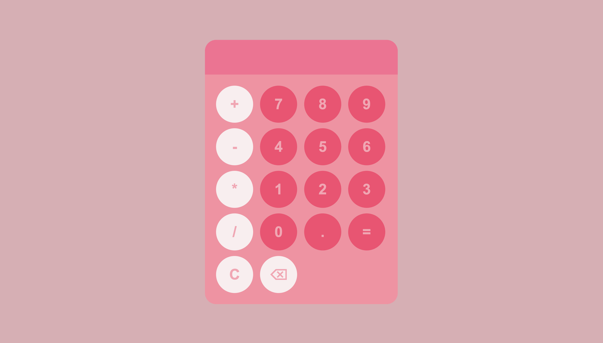

# Simple calculator with a pink theme
**1. Preview**

**2. How to use** 

## 1. Preview
This calculator has a pink theme, where the the numbers and the 4 mathematical symbols are all displayed in a lighter color
than the background color itself. This is to ensure that the user will be able to see the numbers and the mathematical symbols
without having any issue with it blending in the background. As how it´s displayed, the mathematical symbols and the numbers
are in two different colors. This is to ensure that there is a contrast between them, so it´s easier for the user to differentiate them.

When a user is hovering over the numbers and the mathematical symbols with the cursor, a darker shade will display. The same thing 
will happen when the user interact with the buttons by clicking it, however a lighter shade will display. In addition to
the shade changes, the size of the button will also change, where it will appear a bit bigger when the cursor is hovering over the buttons. 

## 2. How to use
Like a normal calculator, you interact with it by entering your equation. This calculate can only do the following equations: plus, minus
multiplication, and division. While the user can enter their equation, if the user perhaps enter the wrong number, they can click on
the backspace button, and also have the alternative of clearing everything. 
